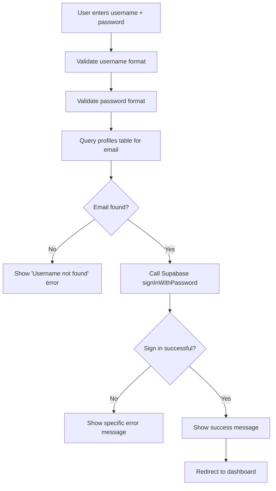

# Login System Refactor

> **Legacy note:** Any references to `registration-after.js` correspond to the previous credential-completion step. The new journey collects usernames and passwords before payment, so login flows now align with `registration-before.js` and `create-pending-user`.

## Overview

Complete refactor of the login system to enforce username/password authentication only, with robust error handling, validation, and improved code structure.

## Changes Made

### 1. **login.html** - UI Updates

#### Removed Email References

- Changed placeholder text from "Username (or email)" to just "Username"
- Updated error messages to remove email fallback options
- Changed registration link from "start your 14-day free trial" to "Register here" pointing to `registration-before.html`

#### Added Input Validation

- **Username field:**
  - `minlength="3"` - Enforces minimum 3 characters
  - `pattern="[a-zA-Z0-9_-]+"` - Only allows letters, numbers, hyphens, and underscores
  - Added helpful `title` attribute for validation feedback

- **Password field:**
  - `minlength="6"` - Enforces minimum 6 characters
  - Added helpful `title` attribute for validation feedback

### 2. **auth.js** - Complete Refactor

#### Code Organization

Restructured into clear sections with JSDoc comments:

- **DOM Elements** - All DOM references at the top
- **Constants** - Configuration values (MIN_USERNAME_LENGTH, MIN_PASSWORD_LENGTH, etc.)
- **UI Feedback Functions** - User interface updates
- **Validation Functions** - Input validation logic
- **Authentication Functions** - Core auth logic
- **Session Management** - Session handling
- **Initialization** - App startup

#### Key Improvements

##### 1. Proper Form Field Handling

**Before:**

```javascript
let identifier = (fd.get('email') ?? '').toString().trim();
// Fallback to direct DOM lookup
const idEl = document.getElementById('email-address');
```

**After:**

```javascript
const username = (formData.get('username') ?? '').toString().trim();
// Correctly matches the HTML form field name
```

##### 2. Robust Validation

- **`validateUsername(username)`**: Checks format, length, and allowed characters
- **`validatePassword(password)`**: Validates password requirements
- Returns structured objects: `{valid: boolean, error?: string}`

##### 3. Separated Concerns

- **`getEmailFromUsername(supabase, username)`**: Handles username → email lookup
- **`signInWithCredentials(supabase, email, password)`**: Handles Supabase authentication
- **`handleLogin(event, supabase)`**: Orchestrates the login flow

##### 4. Better Error Handling

```javascript
// Specific error messages for different scenarios
if (error.message?.includes('Invalid login credentials')) {
  return {
    success: false,
    error:
      'Invalid username or password. If you haven\'t completed registration, click "Continue previous registration" below.',
  };
}
```

##### 5. Enhanced UX

- Disables form inputs during loading state
- Clear, specific error messages
- Proper loading states with visual feedback
- Graceful error recovery

##### 6. Session Management

- **`checkExistingSession()`**: Checks for active sessions before showing login
- **`handleImpersonation()`**: Separated impersonation logic
- Proper auth state change listeners

## Authentication Flow



## Validation Rules

### Username

- **Minimum length**: 3 characters
- **Allowed characters**: Letters (a-z, A-Z), numbers (0-9), hyphens (-), underscores (\_)
- **Case handling**: Normalized to lowercase for database lookup
- **Pattern**: `/^[a-zA-Z0-9_-]+$/`

### Password

- **Minimum length**: 6 characters
- **No character restrictions** (allows special characters)

## Error Messages

### User-Facing Errors

1. **"Username is required."** - Empty username field
2. **"Username must be at least 3 characters."** - Too short
3. **"Username can only contain letters, numbers, hyphens, and underscores."** - Invalid characters
4. **"Password is required."** - Empty password field
5. **"Password must be at least 6 characters."** - Too short
6. **"Username not found. Please check your username and try again."** - Username doesn't exist
7. **"Invalid username or password. If you haven't completed registration, click 'Continue previous registration' below."** - Wrong credentials
8. **"Database error occurred. Please try again."** - Database query failed
9. **"An unexpected error occurred. Please try again."** - Catch-all error

### Developer Errors (Console)

- `[Auth] Database error looking up username:` - Profile query failed
- `[Auth] Sign-in error:` - Supabase auth error
- `[Auth] Unexpected error in getEmailFromUsername:` - Exception in username lookup
- `[Auth] Unexpected error in signInWithCredentials:` - Exception in sign-in
- `[Auth] Unexpected error during login:` - Exception in login handler
- `[Auth] Error checking session:` - Session check failed
- `[Auth] Impersonation error:` - Impersonation token invalid
- `[Auth] Initialization failed:` - Init error

## Security Considerations

### 1. Username Normalization

- All usernames are normalized to lowercase before database lookup
- Prevents case-sensitivity issues
- Consistent with registration flow (see `finalize-registration/index.ts`)

### 2. No Information Leakage

- Generic error messages don't reveal whether username exists
- "Invalid username or password" instead of "Invalid password"
- Prevents username enumeration attacks

### 3. Input Sanitization

- HTML5 pattern validation prevents injection attempts
- Server-side validation in Supabase functions
- Trimming whitespace prevents bypass attempts

### 4. Session Security

- Proper session checking before showing login form
- Auth state listeners for real-time session updates
- Secure token handling for impersonation

## Testing Checklist

- [ ] Valid username + password → Successful login
- [ ] Invalid username → "Username not found" error
- [ ] Valid username + wrong password → "Invalid username or password" error
- [ ] Empty username → "Username is required" error
- [ ] Username < 3 chars → "Username must be at least 3 characters" error
- [ ] Username with special chars → Validation error
- [ ] Empty password → "Password is required" error
- [ ] Password < 6 chars → "Password must be at least 6 characters" error
- [ ] Case-insensitive username (e.g., "JohnDoe" vs "johndoe") → Both work
- [ ] Existing session → Auto-redirect to dashboard
- [ ] "Remember me" checkbox → (Future: implement session persistence)
- [ ] "Forgot password" link → Navigates to forgot-password.html
- [ ] "Continue previous registration" link → Navigates to resume-registration.html
- [ ] Loading state → Inputs disabled, button shows "Signing in…"
- [ ] Network error → Graceful error message
- [ ] Database error → Graceful error message

## Integration with Registration Flow

The login system integrates seamlessly with the registration flow:

1. **Registration** (`registration-after.js`):
   - User creates username + password
   - `finalize-registration` edge function stores normalized username
   - Auto-login after successful registration

2. **Login** (`auth.js`):
   - User enters username + password
   - System looks up email from normalized username
   - Authenticates with Supabase using email + password

3. **Database** (`profiles` table):
   - Stores `username` (normalized to lowercase)
   - Stores `email` (used for authentication)
   - Username is unique per user

## Future Enhancements

1. **Rate Limiting**: Add rate limiting to prevent brute force attacks
2. **Remember Me**: Implement persistent sessions
3. **Password Reset**: Complete forgot password flow
4. **2FA**: Add two-factor authentication option
5. **Login History**: Track login attempts and notify users
6. **Account Lockout**: Lock account after X failed attempts
7. **Password Strength Indicator**: Show password strength on login page
8. **Social Login**: Add OAuth providers (Google, GitHub, etc.)

## Related Files

- `/apps/learner/login.html` - Login page UI
- `/apps/learner/src/auth.js` - Login logic
- `/apps/learner/src/registration-after.js` - Registration flow
- `/supabase/functions/finalize-registration/index.ts` - Registration edge function
- `/apps/shared/supabaseClient.js` - Supabase client initialization

## Memory References

This refactor addresses issues mentioned in previous memories:

- ✅ **MEMORY[1e0a98b4]**: Username normalization (case-insensitive)
- ✅ **MEMORY[ec752335]**: Registration flow integration
- ✅ **MEMORY[400a0727]**: Improved error messages for incomplete registration

---

**Last Updated**: 2025-09-30
**Author**: Senior Developer
**Status**: ✅ Complete
